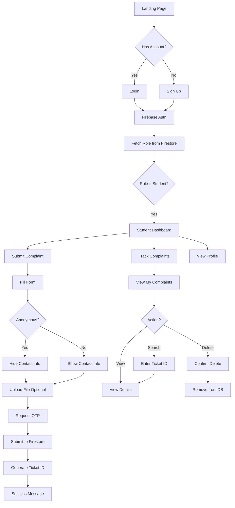
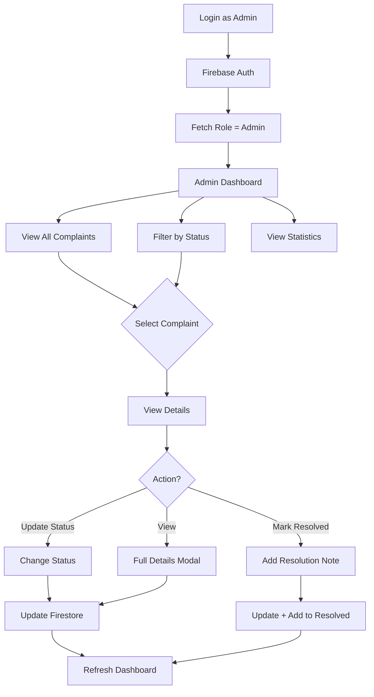

# CampusCare 🎓

A comprehensive campus grievance management system that empowers students to raise concerns, track resolutions, and build a better campus community.


---

## 📋 Table of Contents

- [Features](#-features)
- [Tech Stack](#-tech-stack)
- [Project Structure](#-project-structure)
- [Workflow Diagram](#-workflow-diagram)
- [User Flow](#-user-flow)
- [Installation](#-installation)
- [Firebase Setup](#-firebase-setup)
- [Deployment](#-deployment)
- [Security Rules](#-security-rules)
- [Screenshots](#-screenshots)
- [Contributing](#-contributing)
- [License](#-license)

---

## ✨ Features

### For Students 👨‍🎓
- ✅ **Submit Complaints** - File grievances in multiple categories
- ✅ **Anonymous Submission** - Option to submit complaints anonymously
- ✅ **Real-time Tracking** - Monitor complaint status live
- ✅ **Search by Ticket ID** - Quick lookup using unique ticket IDs
- ✅ **Delete Own Complaints** - Remove submitted complaints
- ✅ **Priority Levels** - Mark urgency (Low, Medium, High)
- ✅ **File Upload** - Attach evidence (PDF/JPEG, max 1MB)
- ✅ **OTP Verification** - Secure submission process

### For Admins 👨‍💼
- ✅ **Dashboard Overview** - View all complaints with statistics
- ✅ **Filter & Sort** - Filter by status (Pending, In Progress, Resolved)
- ✅ **Update Status** - Change complaint status
- ✅ **Mark as Resolved** - Add resolution notes
- ✅ **Resolved Tickets Archive** - View historical data
- ✅ **Full Access** - Read, update, delete any complaint

### General 🌟
- ✅ **Dark Mode** - Toggle between light/dark themes
- ✅ **Responsive Design** - Works on all devices
- ✅ **Modern UI** - Built with Tailwind CSS
- ✅ **Secure Authentication** - Firebase Auth
- ✅ **Role-based Access** - Student/Admin separation

---

## 🛠️ Tech Stack

| Category | Technology |
|----------|-----------|
| **Frontend** | React 19.1.1 |
| **Styling** | Tailwind CSS 3.4.13 |
| **Routing** | React Router DOM 7.8.2 |
| **Backend** | Firebase (Firestore) |
| **Authentication** | Firebase Auth |
| **Animations** | Framer Motion 12.23.12 |
| **Build Tool** | React Scripts (Create React App) |
| **Package Manager** | npm |

---

## 📁 Project Structure

```
campuscare/
├── public/
│   ├── index.html              # Main HTML file
│   ├── favicon.ico             # App icon
│   ├── manifest.json           # PWA manifest
│   └── robots.txt              # SEO robots file
│
├── src/
│   ├── assets/                 # Images and static assets
│   ├── components/             # Reusable components
│   │   ├── Navbar.jsx          # Top navigation bar
│   │   ├── Slidebar.jsx        # Side navigation menu
│   │   ├── ComplaintForm.jsx   # Complaint submission form
│   │   ├── ComplaintList.jsx   # List of complaints
│   │   └── TrackComplaints.jsx # Track & delete complaints
│   │
│   ├── pages/                  # Page components
│   │   ├── AuthContext.jsx     # Authentication context
│   │   ├── ProtectedRoute.jsx  # Route protection
│   │   ├── Dashboard.jsx       # Student dashboard
│   │   ├── AdminDashboard.jsx  # Admin dashboard
│   │   ├── Profile.jsx         # User profile page
│   │   ├── Settings.jsx        # Settings page
│   │   ├── Help.jsx            # Help page
│   │   └── *.jsx               # Other pages (About, Contact, etc.)
│   │
│   ├── LandingPage/
│   │   └── landing.jsx         # Landing page
│   │
│   ├── context/
│   │   └── ThemeContext.jsx    # Dark mode context
│   │
│   ├── firebase.js             # Firebase configuration
│   ├── App.js                  # Main app component
│   ├── App.css                 # Global styles
│   └── index.js                # Entry point
│
├── firestore.rules             # Firestore security rules
├── firestore.indexes.json      # Firestore indexes
├── firebase.json               # Firebase configuration
├── package.json                # Dependencies
├── tailwind.config.js          # Tailwind configuration
└── README.md                   # This file
```

---

## 🔄 Workflow Diagram

```
┌─────────────────────────────────────────────────────────────────────────────┐
│                           CAMPUSCARE SYSTEM FLOW                            │
└─────────────────────────────────────────────────────────────────────────────┘

                                    ┌──────────┐
                                    │  START   │
                                    └────┬─────┘
                                         │
                                         ▼
                              ┌─────────────────────┐
                              │   Landing Page      │
                              │   (Public)          │
                              └─────────┬───────────┘
                                        │
                    ┌───────────────────┼───────────────────┐
                    │                   │                   │
                    ▼                   ▼                   ▼
            ┌───────────────┐   ┌───────────────┐   ┌───────────────┐
            │    Login      │   │    Signup     │   │  Browse Info  │
            │   (Existing)  │   │   (New User)  │   │  (About, etc) │
            └───────┬───────┘   └───────┬───────┘   └───────────────┘
                    │                   │
                    └─────────┬─────────┘
                              │
                              ▼
                    ┌─────────────────┐
                    │  Firebase Auth  │
                    │  Authentication │
                    └────────┬────────┘
                             │
                             ▼
                    ┌─────────────────┐
                    │  Fetch User     │
                    │  Role from DB   │
                    └────────┬────────┘
                             │
              ┌──────────────┴──────────────┐
              │                             │
              ▼                             ▼
     ┌─────────────────┐           ┌─────────────────┐
     │   STUDENT       │           │    ADMIN        │
     │   ROLE          │           │    ROLE         │
     └────────┬────────┘           └────────┬────────┘
              │                             │
              │                             │
              ▼                             ▼
     ┌─────────────────┐           ┌─────────────────┐
     │ Student Dashboard│          │ Admin Dashboard │
     │ ─────────────── │          │ ─────────────── │
     │ • View Stats    │          │ • View All      │
     │ • Submit New    │          │   Complaints    │
     │ • Track Own     │          │ • Filter by     │
     │ • Delete Own    │          │   Status        │
     │ • Search by ID  │          │ • Update Status │
     │                 │          │ • Mark Resolved │
     │                 │          │ • Add Notes     │
     └─────────────────┘           └─────────────────┘
```

---

## 🚶 User Flow

### Student User Flow



### Admin User Flow



---

## 📊 Database Schema

### Collections

#### 1. `complaints`
```javascript
{
  ticketId: "CMP-1234567890-123",      // Unique auto-generated ID
  userEmail: "student@college.edu",    // User's email
  contact: "optional@email.com",       // Contact info (if not anonymous)
  anonymous: true/false,               // Anonymous submission flag
  issueRegarding: "Academics",         // Main category
  subIssue: "Assignments",             // Sub-category
  title: "Complaint Title",            // Short title
  priority: "High/Medium/Low",         // Priority level
  location: "Building A, Room 101",    // Location of issue
  description: "Detailed description", // Full description
  otpMethod: "Email/Mobile",           // OTP delivery method
  fileName: "document.pdf",            // Uploaded file name
  status: "Pending/In Progress/Resolved", // Current status
  resolutionNote: "Resolution details",   // Admin resolution note
  createdAt: Timestamp,                // Submission timestamp
  updatedAt: Timestamp,                // Last update timestamp
  resolvedAt: Timestamp                // Resolution timestamp
}
```

#### 2. `users`
```javascript
{
  uid: "firebase-uid",                 // Firebase User ID
  email: "user@college.edu",           // User email
  displayName: "User Name",            // Display name
  role: "student/admin",               // User role
  createdAt: Timestamp                 // Account creation timestamp
}
```

#### 3. `resolvedTickets` (Archive)
```javascript
{
  complaintId: "doc-id",               // Reference to original complaint
  resolutionNote: "Resolution text",   // Resolution details
  resolvedAt: Timestamp                // Resolution timestamp
}
```

---

## 🔐 Security Rules

### Firestore Rules (`firestore.rules`)

```javascript
rules_version = '2';
service cloud.firestore {
  match /databases/{database}/documents {
    // Check if user is admin
    function isAdmin() {
      return get(/databases/$(database)/documents/users/$(request.auth.uid)).data.role == 'admin';
    }
    
    match /complaints/{complaintId} {
      // Read: Own complaints OR admin
      allow read: if request.auth != null && 
                     (resource.data.userEmail == request.auth.token.email || isAdmin());
      
      // Create: Any authenticated user
      allow create: if request.auth != null;
      
      // Update/Delete: Own complaints OR admin
      allow update, delete: if request.auth != null && 
                               (resource.data.userEmail == request.auth.token.email || isAdmin());
    }
    
    match /users/{userId} {
      // Read: Own data OR admin
      allow read: if request.auth != null && 
                     (request.auth.uid == userId || isAdmin());
      
      // Update: Own data only
      allow update: if request.auth != null && request.auth.uid == userId;
    }
  }
}
```

---

## 🚀 Installation

### Prerequisites
- Node.js (v14 or higher)
- npm or yarn
- Firebase account

### Steps

1. **Clone the repository**
   ```bash
   git clone https://github.com/yourusername/campuscare.git
   cd campuscare
   ```

2. **Install dependencies**
   ```bash
   npm install
   ```

3. **Configure Firebase**
   - Create a Firebase project at [console.firebase.google.com](https://console.firebase.google.com)
   - Enable Authentication (Email/Password)
   - Enable Firestore Database
   - Copy your Firebase config to `src/firebase.js`

4. **Update Firebase Config** (`src/firebase.js`)
   ```javascript
   const firebaseConfig = {
     apiKey: "YOUR_API_KEY",
     authDomain: "YOUR_PROJECT_ID.firebaseapp.com",
     projectId: "YOUR_PROJECT_ID",
     storageBucket: "YOUR_PROJECT_ID.appspot.com",
     messagingSenderId: "YOUR_SENDER_ID",
     appId: "YOUR_APP_ID"
   };
   ```

5. **Deploy Firestore Rules**
   ```bash
   npm install -g firebase-tools
   firebase login
   firebase deploy --only firestore:rules,firestore:indexes
   ```

6. **Start Development Server**
   ```bash
   npm start
   ```

7. **Build for Production**
   ```bash
   npm run build
   ```

---

## 🔥 Firebase Setup

### 1. Create Firebase Project
1. Go to [Firebase Console](https://console.firebase.google.com)
2. Click "Add Project"
3. Enter project name: `campuscare`
4. Follow the setup wizard

### 2. Enable Authentication
1. Navigate to **Authentication** → **Sign-in method**
2. Enable **Email/Password**
3. Save

### 3. Create Firestore Database
1. Navigate to **Firestore Database**
2. Click **Create Database**
3. Start in **Test Mode** (we'll deploy secure rules next)
4. Choose a location closest to your users

### 4. Deploy Security Rules
```bash
firebase init firestore
# Select: Use existing project → campuscare
# Select: firestore.rules (existing file)
# Select: firestore.indexes.json (existing file)

firebase deploy --only firestore:rules,firestore:indexes
```

### 5. Create Admin User
1. Manually create a user via signup
2. Go to **Firestore Database** in Firebase Console
3. Create collection: `users`
4. Add document with user's UID
5. Set field: `role: "admin"`

---

## 🌐 Deployment

### Option 1: Firebase Hosting

```bash
# Install Firebase CLI
npm install -g firebase-tools

# Login
firebase login

# Initialize (select Hosting)
firebase init hosting

# Deploy
firebase deploy --only hosting
```

### Option 2: Vercel

```bash
# Install Vercel CLI
npm install -g vercel

# Deploy
vercel
```

### Option 3: Netlify

```bash
# Build
npm run build

# Drag and drop 'build' folder to Netlify
# Or use Netlify CLI
npm install -g netlify-cli
netlify deploy --prod
```

---

## 📱 API Endpoints (Firestore)

| Operation | Collection | Method | Description |
|-----------|-----------|--------|-------------|
| Create Complaint | `complaints` | `addDoc()` | Submit new complaint |
| Get My Complaints | `complaints` | `getDocs(query)` | Fetch user's complaints |
| Get All Complaints | `complaints` | `getDocs(query)` | Admin: fetch all |
| Update Status | `complaints/{id}` | `updateDoc()` | Change complaint status |
| Delete Complaint | `complaints/{id}` | `deleteDoc()` | Remove complaint |
| Search by Ticket | `complaints` | `getDocs(query)` | Find by ticketId |
| Get User Role | `users/{uid}` | `getDoc()` | Fetch user role |

---

## 🎨 Color Scheme

| Color | Hex Code | Usage |
|-------|----------|-------|
| Primary Blue | `#2563EB` | Buttons, links, accents |
| Primary Purple | `#7C3AED` | Gradients, highlights |
| Success Green | `#10B981` | Resolved status, success |
| Warning Yellow | `#F59E0B` | In Progress status |
| Danger Red | `#EF4444` | Delete, errors |
| Dark Gray | `#1F2937` | Text, backgrounds |
| Light Gray | `#F3F4F6` | Backgrounds, borders |

---

## 📈 Future Enhancements

- [ ] Email notifications on status updates
- [ ] SMS alerts via Twilio
- [ ] File upload to Firebase Storage
- [ ] Analytics dashboard for admins
- [ ] Export complaints to CSV/PDF
- [ ] Multi-language support
- [ ] Mobile app (React Native)
- [ ] Chat support integration
- [ ] Automated ticket assignment
- [ ] SLA tracking for resolutions

---

## 🤝 Contributing

1. Fork the repository
2. Create your feature branch (`git checkout -b feature/AmazingFeature`)
3. Commit your changes (`git commit -m 'Add some AmazingFeature'`)
4. Push to the branch (`git push origin feature/AmazingFeature`)
5. Open a Pull Request

---

## 📄 License

This project is licensed under the MIT License - see the [LICENSE](LICENSE) file for details.

---

## 👥 Team

Built with ❤️ by the CampusCare Team

---

## 📞 Support

For support, email support@campuscare.com or join our Slack channel.

---

<div align="center">

**Made with React & Firebase**

⭐ Star this repo if you find it helpful!

</div>
